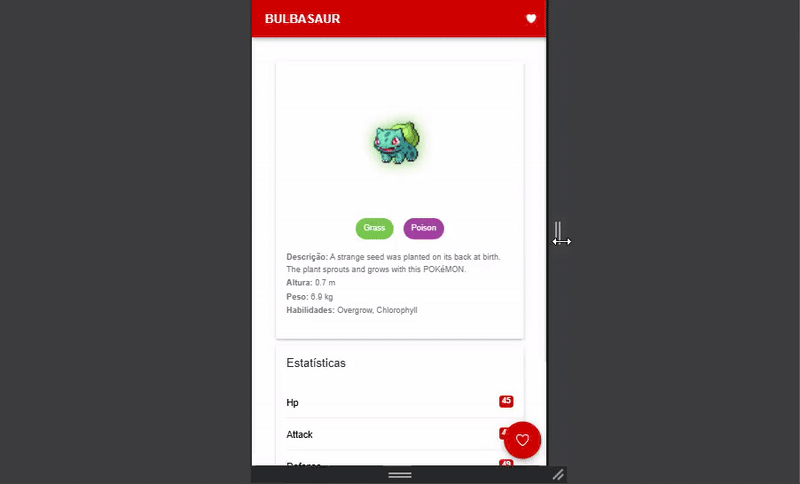

# 📱 Pokedex App


Este projeto foi desenvolvido como parte de um desafio técnico para uma entrevista de emprego. Utiliza **Ionic** com **Angular** e consome dados da [PokeAPI](https://pokeapi.co/). O objetivo é criar uma Pokedex funcional, responsiva e de fácil navegação.

## 🚀 Tecnologias Utilizadas

- Ionic Framework
- Angular
- TypeScript
- RxJS
- PokeAPI

## 🌐 Acesse Online

Acesse a Pokedex diretamente pelo navegador:  
[https://caioorleans.github.io/pokedex/](https://caioorleans.github.io/pokedex/)

## 🎥 Demonstração

### 🏠 Tela Inicial


---

### 📄 Tela de Detalhes



---

## ✅ Funcionalidades Implementadas

- Página inicial com listagem de Pokémons usando dados da PokeAPI
- Paginação com infinite scroll do Ionic
- Redirecionamento para página de detalhes do Pokémon
- Exibição de detalhes: nome, imagem, descrição, tipos e stats
- Layout responsivo para diferentes orientações de dispositivos
- Função de favoritar Pokémons ⭐
- Acesso à lista de favoritos
- **Deploy automático via GitHub Actions para GitHub Pages**

## 🔜 O que falta implementar

- Testes unitários

## 🛠️ Como rodar o projeto

```bash
git clone https://github.com/seu-usuario/pokedex.git
cd pokedex
npm install
ionic serve
```

## ⚠️ Aviso

> Este projeto ainda está em construção! Novas funcionalidades serão adicionadas em breve. Fique à vontade para sugerir melhorias ou contribuir! 🚧